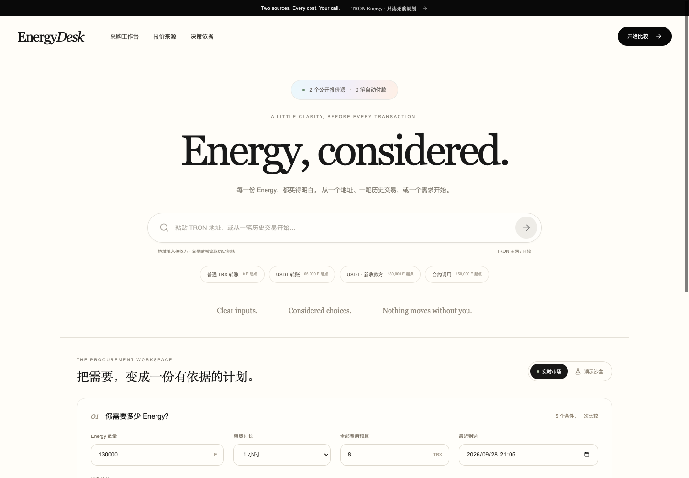

# EnergyDesk

> **GWDC 2026 Korea · TRON Challenge A**  
> Multi-vendor TRON Energy procurement and cost-comparison assistant.

EnergyDesk plans the Energy required to close 86 event-worker payments before a fixed deadline. It normalizes two live quote sources, checks inventory, minimum orders, delivery assumptions and full cost, then compares single-vendor and split-order plans. A stale quote invalidates the old plan and triggers a deterministic re-plan.

**中文简介：** EnergyDesk 为活动关账前的 TRON Energy 采购做双供应商比价、库存与期限校验、拆单搜索和完整费用解释。报价过期后旧方案会亮红灯，再按新库存重新分配。



## Submission materials · 提交材料

- [Public GitHub repository](https://github.com/Jimmycoding0301/gwdc-2026-energydesk)
- [56-second demo video](https://github.com/Jimmycoding0301/gwdc-2026-energydesk/raw/refs/heads/main/docs/submission/demo.mp4)
- [Pitch deck](https://github.com/Jimmycoding0301/gwdc-2026-energydesk/raw/refs/heads/main/docs/submission/pitch-deck.pptx)

## Challenge fit · 赛题对应

- **Two real quote sources:** TronEnergyRent and the read-only Energy service documented by JustLend's official MCP project.
- **Normalized comparison:** Energy, SUN/TRX, supported duration, minimum and maximum order, availability, delivery assumption and expiry.
- **Plan search:** single-provider plans plus two-provider split orders within the documented search scope.
- **Full cost:** rental, activation, service, chain reserve and other user-entered reserve.
- **Failure behavior:** a failed live source stays failed; the app never silently labels fixture data as live.

## Two-minute demo · 两分钟演示

1. Load the Seoul event closing scenario: 86 workers, 86 payments and 5,590,000 Energy.
2. Generate a plan. Neither provider can cover the request alone, so the system selects a split.
3. Simulate quote expiry and reduced cheap-source inventory. The original allocation turns red and is recalculated.
4. Copy the handoff brief with all costs, assumptions, source times and snapshot digest.
5. Open the verified Nile receipt and its public TRONSCAN transaction.

## Verified Nile evidence · 已核验 Nile 证据

- Registry: [`TSqoRAmu4qviTuscsakTWdYRZQjpiTjP2u`](https://nile.tronscan.org/#/contract/TSqoRAmu4qviTuscsakTWdYRZQjpiTjP2u)
- Deployment: [`7f481964…b091`](https://nile.tronscan.org/#/transaction/7f48196490dccdda47e1ca0166d99c7b9b583d4cc5ea5c3b802838c26fd0b091)
- EnergyDesk receipt: [`956b8f7e…bd9`](https://nile.tronscan.org/#/transaction/956b8f7ea035c816210e6f03a9c97b827069d777a8d26e92b0d6fce6a1a47bd9)
- Public evidence files: [deployment](docs/evidence/registry-deployment.json) and [receipt](docs/evidence/energydesk-receipt.json).

The receipt is a zero-value commitment to a **fixture procurement decision**. It proves the wallet committed that payload and the confirmed transaction matches it. It does not prove Energy was ordered, delivered, or price-locked.

Recording cues: [docs/demo-script.md](docs/demo-script.md).

## Run locally · 本地运行

```bash
npm ci
cp .env.example .env
npm run dev
```

- Web: <http://127.0.0.1:5175>
- API: <http://127.0.0.1:8789/api/health>

The public Registry address is already present in `.env.example`. TronLink must be installed and switched to Nile only when signing a new testnet receipt. Private keys never enter this application.

```bash
npm test
npm run build
```

## Data and calculation boundaries · 数据与计算边界

Live mode calls public quote endpoints. Demo mode uses clearly labeled local snapshots so the presentation remains repeatable. Amounts use integer SUN and `BigInt`; the optimizer only claims the best result within its documented providers, grid and boundary candidates.

The UI does not place an Energy order, debit a provider balance, lock a price or guarantee delivery. Before any real purchase, the operator must re-quote the exact split and verify wallet resources and provider terms.

## Repository map · 目录

- `server/providers.ts` — live adapters and explicit fixtures.
- `shared/optimizer.ts` — deterministic plan and cost search.
- `shared/evidence.ts` / `server/evidence.ts` — canonical receipt and independent Nile verification.
- `contracts/ReceiptRegistry.sol` — minimal shared receipt registry.
- `tests/` — provider schema, optimizer, intake, recovery and evidence tests.

See [SUBMISSION.md](SUBMISSION.md), [HACKATHON_SCOPE.md](HACKATHON_SCOPE.md), [SECURITY.md](SECURITY.md), and the [contract notes](contracts/README.md).
